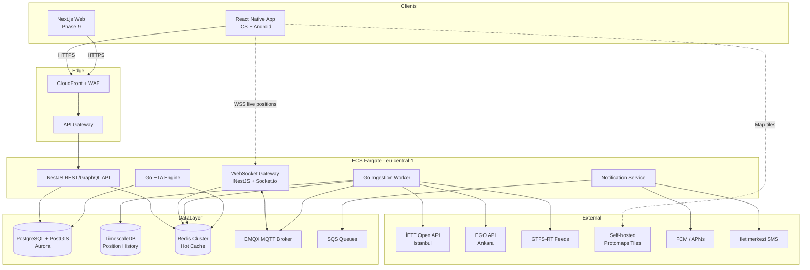

# 🚌 BUILD ROADMAP — Real-Time Public Transport Tracker (Turkey)

> **Document Type:** Production-Grade Phased Execution Plan
> **Target:** Istanbul + Ankara (MVP) → Multi-City Turkey (Scale)
> **Compliance:** KVKK (Turkey) + GDPR (EU readiness)
> **Last Generated:** 2026-05-05

---

## 1. APP OVERVIEW

### One-Sentence Description

A mobile-first, real-time public transportation tracking platform that shows live vehicle positions and accurate ETAs for buses, metros, trams and ferries across major Turkish cities — starting with Istanbul (İETT) and Ankara (EGO).

### Target Users & Use Cases

| Segment                           | Use Case                                                                                |
| --------------------------------- | --------------------------------------------------------------------------------------- |
| **Daily commuters** (primary)     | "Should I leave home now to catch the 500T?" — open app → see ETA → leave on time.      |
| **Tourists**                      | "How do I get from Sultanahmet to Taksim?" — search stop, see arrivals, follow vehicle. |
| **Students**                      | Set favorite stops near campus, get push notifications before bus arrives.              |
| **Elderly / accessibility users** | Simplified UI, voice search, large text mode, low-data mode.                            |

### Core Value Proposition

> **"Never wait at the stop again."** Sub-3-second ETA accuracy, works on poor 3G, free for daily use.

### Success Metrics (MVP Stage — first 6 months)

| KPI                        | Target                      |
| -------------------------- | --------------------------- |
| MAU (Monthly Active Users) | 50,000 (combined IST + ANK) |
| D1 / D7 / D30 retention    | 45% / 25% / 15%             |
| Median ETA error           | ≤ 90 seconds                |
| Crash-free sessions        | ≥ 99.5%                     |
| API p95 latency            | ≤ 400 ms                    |
| App store rating           | ≥ 4.4                       |
| Free-to-Premium conversion | ≥ 2% by month 6             |

---

## 2. RECOMMENDED TECH STACK

### Frontend (Mobile — Primary)

- **React Native + Expo (SDK 52+)** with **expo-router**
  - **Why:** Single TS codebase for iOS + Android; OTA updates via EAS Update (critical for hotfixing ETA bugs); huge ecosystem; Expo Maps + react-native-maps for native map performance; CodePush-style deploys without store review.
  - **Alternative considered:** Flutter — rejected because the team standardizes on TypeScript across stack and React Native has stronger Mapbox/MapLibre native bindings.

### Frontend (Web — Secondary, Phase 9)

- **Next.js 15 (App Router) + React Server Components + TypeScript**
  - **Why:** SEO for stop pages (`/durak/kadikoy-iskele`), shared component library with mobile via design tokens, edge caching on Vercel/CloudFront.

### Backend

- **Node.js 22 LTS + NestJS 11 (TypeScript)** for REST/GraphQL aggregation API
  - **Why:** Modular DI, opinionated structure prevents architectural drift across phases, native OpenAPI/Swagger gen, mature WebSocket gateway.
- **Go 1.23** for the **Real-Time Ingestion Worker** (vehicle position consumer + ETA engine)
  - **Why:** Sub-millisecond GC pauses matter when processing 50k+ position updates/min. Single binary, easy K8s deploy.
- **MQTT (EMQX)** as the internal pub/sub for vehicle position fan-out to WebSocket clients.

### Database & Cache

- **PostgreSQL 16 + PostGIS 3.4** — primary store (users, stops, routes, schedules, geo queries)
- **Redis 7 (ElastiCache)** — hot cache for current vehicle positions, ETA cache, rate-limit counters, session blacklist
- **TimescaleDB extension on PostgreSQL** — historical position data for ML ETA training (Phase 11)
- **ORM:** **Prisma 6** for NestJS (type-safe, great DX); raw SQL via `pgx` in Go worker for hot paths.

### Authentication & Authorization

- **Custom JWT (RS256)** with refresh token rotation, stored in `expo-secure-store` on mobile, `httpOnly` cookies on web
- **OAuth providers:** Google, Apple (mandatory for iOS), email/password
- **Why custom over Auth0/Cognito:** KVKK requires data residency control; Auth0 EU region adds latency and €€€ at scale; Cognito's DX is poor.
- **OTP fallback** via SMS (Iletimerkezi or NetGSM — Turkish providers, KVKK-compliant)

### Hosting / Infrastructure

- **AWS eu-central-1 (Frankfurt)** — closest region with KVKK-acceptable data processing agreement
  - **ECS Fargate** for API + workers (start) → **EKS** when team grows (Phase 12)
  - **RDS Aurora PostgreSQL** Multi-AZ
  - **ElastiCache Redis** cluster mode
  - **CloudFront** + **S3** for static assets, map tile caching
  - **API Gateway + WAF** for rate limiting and bot protection
  - **SQS + EventBridge** for async jobs (notifications, analytics)
  - **Secrets Manager** for credentials, never in env files
- **Mobile maps:** **MapLibre GL Native** + self-hosted tiles via **Protomaps + S3** (10× cheaper than Mapbox at scale, no per-MAU pricing)
- **Push notifications:** **Expo Push** initially, migrate to **FCM + APNs direct** in Phase 8

### CI/CD + Observability

- **GitHub Actions** — PR checks, build, deploy
- **EAS Build + Submit** for mobile binaries
- **Terraform** for IaC (all AWS resources)
- **Datadog** — APM, logs, RUM (real user monitoring on mobile)
  - Open-source alternative if cost-prohibitive: Grafana Cloud + Loki + Tempo + Prometheus
- **Sentry** — error tracking (mobile + backend), source-mapped
- **Feature flags:** **Unleash** (self-hosted, KVKK-friendly) or **GrowthBook**

### Other Tools

| Tool                | Purpose                                            |
| ------------------- | -------------------------------------------------- |
| **i18next**         | TR/EN localization, fallback chain                 |
| **Zod**             | Runtime input validation (shared mobile + backend) |
| **TanStack Query**  | Mobile data fetching/caching                       |
| **Zustand**         | Mobile lightweight state (UI only)                 |
| **React Hook Form** | Forms                                              |
| **Detox + Maestro** | E2E mobile tests                                   |
| **Playwright**      | Web E2E                                            |
| **Jest + Vitest**   | Unit tests                                         |
| **k6**              | Load testing                                       |
| **Storybook**       | Component dev environment                          |

---

## 3. SYSTEM ARCHITECTURE

### High-Level Diagram (Mermaid)



### Data Model Overview (Core Entities)

```
User
 ├─ id (uuid, PK)
 ├─ email (unique, encrypted-at-rest)
 ├─ phone_e164 (nullable, encrypted)
 ├─ password_hash (argon2id)
 ├─ locale (tr|en)
 ├─ premium_tier (free|premium)
 ├─ kvkk_consent_at (timestamp)
 └─ created_at / updated_at / deleted_at (soft delete for KVKK right-to-erasure)

City
 ├─ id, code (IST|ANK), name, timezone
 └─ bbox (geometry)

Operator           # IETT, EGO, Metro Istanbul, etc.
 ├─ id, city_id, name, source_type (REST|GTFS-RT|MQTT)
 └─ api_config (jsonb, encrypted)

Route
 ├─ id, operator_id, code (e.g. "500T"), name_tr, name_en
 ├─ mode (bus|metro|tram|ferry|funicular)
 ├─ shape (LINESTRING via PostGIS)
 └─ active (bool)

Stop
 ├─ id, operator_id, external_id, name_tr, name_en
 ├─ location (POINT, GIST-indexed)
 └─ accessibility_features (jsonb)

RouteStop          # ordered join table
 ├─ route_id, stop_id, sequence, direction (0|1)
 └─ scheduled_arrival_offsets (int[])

Vehicle            # ephemeral; current state in Redis, history in TimescaleDB
 ├─ id, route_id, plate, capacity_class
 └─ current_position (POINT) — written to Redis, periodically snapshotted

VehiclePosition (TimescaleDB hypertable)
 ├─ time (PK part), vehicle_id, route_id
 ├─ location, speed_kmh, heading
 └─ source_lag_ms

UserFavorite
 ├─ user_id, target_type (stop|route), target_id
 └─ alert_config (jsonb: {minutes_before, days_of_week})

Notification
 ├─ id, user_id, type, payload, sent_at, status
 └─ idempotency_key
```

### API Design Approach

- **REST** for CRUD (`/v1/stops`, `/v1/routes`, `/v1/users/me/favorites`)
- **WebSocket** namespace `/live` for streaming vehicle positions (subscribe by route_id or bbox)
- **GraphQL** considered but rejected for MVP — overkill, REST + WS is simpler and cacheable
- **Versioned** via URL prefix (`/v1`, `/v2`)
- **OpenAPI 3.1** auto-generated from NestJS decorators, published to `/docs`
- **Pagination:** cursor-based (opaque `cursor` param), never offset (large datasets)
- **Errors:** RFC 7807 Problem Details JSON
- **Rate limits:** per-user (auth) and per-IP (anon), Redis token bucket, headers `X-RateLimit-*`
- **Idempotency:** `Idempotency-Key` header on POST/PUT for notifications and payments

### Folder Structure Summary

```
app-bus/                              # monorepo (pnpm workspaces + Turborepo)
├── apps/
│   ├── mobile/                       # Expo React Native
│   │   ├── app/                      # expo-router routes
│   │   ├── src/
│   │   │   ├── features/             # feature-sliced (map, stops, eta, auth, settings)
│   │   │   ├── shared/               # ui kit, hooks, api client
│   │   │   ├── i18n/                 # tr.json, en.json
│   │   │   └── lib/                  # platform helpers
│   │   └── app.config.ts
│   ├── api/                          # NestJS
│   │   ├── src/
│   │   │   ├── modules/              # auth, users, stops, routes, eta, notifications
│   │   │   ├── common/               # guards, interceptors, filters
│   │   │   ├── config/
│   │   │   └── main.ts
│   │   └── prisma/
│   ├── ingestion/                    # Go worker
│   │   ├── cmd/ingestion/
│   │   ├── internal/{iett,ego,gtfs,mqtt,redis,db}/
│   │   └── go.mod
│   ├── eta-engine/                   # Go ETA service
│   └── web/                          # Next.js (Phase 9)
├── packages/
│   ├── ui/                           # shared React Native + RNW components
│   ├── types/                        # shared TS types (zod schemas → types)
│   ├── api-client/                   # auto-generated from OpenAPI
│   └── config/                       # eslint, tsconfig, prettier presets
├── infra/
│   ├── terraform/
│   │   ├── modules/{network,ecs,rds,redis,cloudfront}/
│   │   └── envs/{dev,staging,prod}/
│   └── k8s/                          # Phase 12+
├── .github/workflows/
├── docs/
│   ├── architecture/
│   ├── runbooks/
│   └── adr/                          # Architecture Decision Records
├── BUILD_ROADMAP.md
├── PROJECT_STATE.md
├── CLAUDE.md
└── README.md
```

---

## 4. PHASE PLAN

> **Convention:** Each phase is independently deployable to staging. No phase ships to production without passing the validation checklist at the end of that phase.

---

## 🟢 MVP PHASES

---

### 📍 Phase 0: Project Foundation & DevOps Skeleton

**Objective:**
Establish the monorepo, CI/CD, infrastructure-as-code skeleton, and developer experience baseline so all subsequent phases ship quickly and safely.

**Dependencies:** None.

**Deliverables:**

- pnpm + Turborepo monorepo with `apps/` and `packages/`
- ESLint + Prettier + commitlint + Husky pre-commit hooks
- GitHub Actions: lint, typecheck, unit test on every PR
- Terraform modules for VPC, RDS, Redis, ECS cluster (dev env only)
- AWS dev account with SSO, IAM least-privilege roles
- Sentry projects for `mobile`, `api`, `ingestion`
- Basic `README.md`, `CONTRIBUTING.md`, `.env.example`

**Tech Decisions:**

- pnpm 9, Turborepo 2, Node 22 LTS, Go 1.23
- Terraform 1.10, OpenTofu-compatible
- GitHub Actions with OIDC → AWS (no long-lived keys)

**Tasks:**

_Infrastructure_

- [ ] Bootstrap Terraform state in S3 + DynamoDB lock table
- [ ] VPC: 3 AZs, public + private subnets, NAT gateway (single for dev, HA for prod)
- [ ] ECS Fargate cluster, ECR repos
- [ ] Aurora PostgreSQL serverless v2 (dev) with PostGIS extension
- [ ] ElastiCache Redis (dev: single node)
- [ ] Secrets Manager bootstrap

_Backend_

- [ ] NestJS scaffold with `/health` endpoint, structured logging (pino), config module
- [ ] Prisma init + first migration (User table only, placeholder)
- [ ] Dockerfile (multi-stage, distroless final image)

_Mobile_

- [ ] `npx create-expo-app` with TypeScript template
- [ ] Configure expo-router, design tokens, theme provider
- [ ] EAS Build profiles: development, preview, production
- [ ] Sentry SDK integration

_Testing_

- [ ] Jest config for `api` and `packages/*`
- [ ] Vitest for utilities
- [ ] Playwright skeleton (used in Phase 9)

**Critical Considerations:**

- **Security:** No secrets in repo — enforce with `gitleaks` in pre-commit and CI
- **Performance:** Turborepo remote cache (Vercel or self-hosted on S3) cuts CI from 8min → 2min
- **Compliance:** AWS region must be eu-central-1 (Frankfurt). Document KVKK data flow now, not later.
- **DevEx:** New engineer must reach `pnpm dev` running locally in ≤ 30 minutes

**Execution Prompt (for AI Agent):**

```
Build the foundation for a TypeScript/Go monorepo for a real-time transit app.

REQUIREMENTS:
1. Monorepo at repo root using pnpm workspaces + Turborepo 2.x.
2. Create apps/mobile (Expo SDK 52, TS, expo-router), apps/api (NestJS 11, TS, Prisma 6, pino logging),
   apps/ingestion (Go 1.23, structured logging via slog).
3. Shared packages: packages/types (zod schemas + inferred TS types), packages/config (shared
   tsconfig.base.json, eslint.config.mjs, prettier.config.mjs).
4. Infrastructure in infra/terraform: VPC (3 AZ), ECS Fargate cluster, Aurora PostgreSQL serverless v2
   with PostGIS, ElastiCache Redis 7, Secrets Manager, ECR. Terraform state in S3 + DynamoDB.
5. GitHub Actions: matrix workflow for lint/typecheck/test on PR. OIDC auth to AWS, no static keys.
   EAS Build trigger on tag.
6. Pre-commit: husky + lint-staged + gitleaks.
7. Each app has /health endpoint and Sentry integrated.
8. Document everything in README.md including local dev quickstart (must succeed in <30 min for a new dev).

DO NOT:
- Implement business logic in this phase.
- Add authentication beyond a placeholder User table.
- Create UI screens beyond a "Hello" splash.
- Hardcode any secrets or AWS account IDs.

Acceptance: `pnpm install && pnpm dev` starts api on :3000, mobile on Expo Go, both with /health green.
`terraform plan` succeeds with no errors against a fresh AWS account.
```

**Risk:** 🟢 Low | **Effort:** 1 week (1 senior eng)

---

### 📍 Phase 1: Authentication & User Management

**Objective:**
Production-ready auth with email/password, Google, Apple OAuth, KVKK-compliant consent flow, and refresh-token rotation.

**Dependencies:** Phase 0.

**Deliverables:**

- `/auth/register`, `/auth/login`, `/auth/refresh`, `/auth/logout`, `/auth/forgot-password`
- OAuth: Sign in with Google, Sign in with Apple (Apple is mandatory for iOS App Store)
- KVKK consent screen on first launch with versioned consent record
- User profile screen: edit name, locale, delete account (KVKK right to erasure)
- Email verification via SES; SMS OTP via İletimerkezi (Turkish provider, KVKK DPA signed)
- JWT (RS256) — 15min access, 30day refresh with rotation; refresh stored hashed in DB
- Mobile: biometric unlock (Face ID / fingerprint) for premium users (Phase 8 feature flag)

**Tech Decisions:**

- `@nestjs/jwt`, `argon2id` for password hashing (memory cost 64MB, parallelism 4)
- `expo-auth-session` for OAuth flows, `expo-secure-store` for token storage
- `expo-apple-authentication`, `@react-native-google-signin/google-signin`

**Tasks:**

_Backend_

- [ ] Prisma schema: User, RefreshToken, OAuthIdentity, KvkkConsent
- [ ] Argon2id password hashing service (parameters tuned for ~250ms on prod hardware)
- [ ] JWT module with RS256 keys from Secrets Manager (rotated quarterly)
- [ ] AuthGuard, RolesGuard
- [ ] Rate limiting: 5 login attempts / 15 min / IP, exponential backoff after 3 fails
- [ ] Email service abstraction: AWS SES adapter
- [ ] SMS service abstraction: İletimerkezi adapter (with Twilio fallback for non-TR numbers)
- [ ] Account deletion job: anonymize PII, retain non-PII for 90 days then purge

_Mobile_

- [ ] Auth navigation flow (welcome → login/register → KVKK consent → home)
- [ ] Form validation with React Hook Form + Zod (schemas shared via `packages/types`)
- [ ] Token refresh interceptor in API client (handles 401 → refresh → retry once)
- [ ] Biometric prompt component
- [ ] KVKK consent screen with versioned text, scroll-to-bottom required, log consent_version + timestamp + IP

_Testing_

- [ ] Unit: password hashing, JWT signing/verification, rate limiter
- [ ] Integration: full auth flow against a Testcontainers postgres
- [ ] E2E (Detox): register → verify email (mock) → login → access protected route
- [ ] Security: try replay of revoked refresh token, verify it's rejected and triggers token family invalidation

**Critical Considerations:**

- **Security:**
  - Never log passwords, tokens, or OTPs
  - Refresh token rotation: each refresh issues new refresh, invalidates old; reuse detection invalidates entire token family
  - Apple Sign In: validate `aud`, `iss`, JWS signature against Apple's JWKS
  - Email enumeration: same response for "user exists" vs "doesn't exist" on password reset
- **Performance:** Argon2id tuned to 250ms — slow enough to deter brute force, fast enough not to UX-block
- **Edge Cases:** User registers with email then later signs in with Google using same email — auto-link with consent prompt
- **UX:** Locale auto-detect from device, default to TR. Phone number input uses libphonenumber, displays as +90 5XX XXX XX XX
- **KVKK:**
  - Explicit consent for data processing, separate consent for marketing
  - Consent text in TR (legally required), version-tracked
  - Privacy policy URL in app, accessible without login
  - Data export endpoint `/users/me/export` returns JSON of all user data
  - Account deletion is soft (90-day grace) then hard purge

**Execution Prompt (for AI Agent):**

```
Implement production-grade authentication for the transit app.

CONTEXT: Monorepo from Phase 0 exists. NestJS API at apps/api, Expo mobile at apps/mobile.
Postgres + Prisma already configured. KVKK (Turkish data protection law similar to GDPR) compliance
is mandatory.

REQUIREMENTS:
1. Backend (apps/api):
   - Prisma models: User (id, email unique citext, password_hash, locale, name, phone_e164,
     created_at, deleted_at), RefreshToken (id, user_id, token_hash, family_id, expires_at,
     revoked_at), OAuthIdentity (provider, provider_user_id, user_id), KvkkConsent
     (user_id, version, accepted_at, ip, user_agent).
   - POST /v1/auth/register, /login, /refresh, /logout, /oauth/google, /oauth/apple,
     /forgot-password, /reset-password, /verify-email.
   - GET /v1/users/me, PATCH /v1/users/me, DELETE /v1/users/me (soft delete + 90d purge job).
   - GET /v1/users/me/export (KVKK data export).
   - argon2id password hashing (memory=64MB, parallelism=4, time=3).
   - JWT RS256, 15min access, 30day refresh with rotation + reuse detection.
   - Rate limit: 5 login/15min/IP, exponential backoff after 3 failures.
   - Email via AWS SES, SMS via İletimerkezi (env-configurable adapter).
2. Mobile (apps/mobile):
   - expo-router routes: /auth/welcome, /auth/login, /auth/register, /auth/kvkk-consent,
     /auth/forgot-password, /(tabs)/profile.
   - expo-secure-store for tokens, expo-local-authentication for biometric (premium flag, off by default).
   - expo-auth-session for Google, expo-apple-authentication for Apple.
   - i18next with tr.json + en.json, device locale autodetect.
   - Token refresh interceptor in shared api-client package.
3. Testing:
   - Jest unit tests (≥80% coverage on auth module).
   - Integration tests via Testcontainers postgres.
   - Detox E2E: register → login → access /v1/users/me.

DO NOT:
- Store plaintext passwords, tokens, or OTPs in logs.
- Use HS256 (must be RS256 with keys from Secrets Manager).
- Skip Apple Sign In (required by App Store for iOS apps offering social login).
- Differentiate "user not found" from "wrong password" on login response.
- Hardcode JWT keys.

Acceptance: full auth flow works on iOS sim, Android emulator, web (postman). KVKK consent stored.
Account deletion soft-deletes user and schedules purge job. Refresh token reuse triggers family invalidation.
```

**Risk:** 🟡 Medium (security-critical, KVKK legal exposure) | **Effort:** 2 weeks

---

### 📍 Phase 2: Static Transit Data — Stops, Routes, Schedules

**Objective:**
Ingest, normalize, and serve the static transit dataset (stops, routes, schedules) for Istanbul (İETT) and Ankara (EGO). This is the foundation that real-time positions in Phase 3 will reference.

**Dependencies:** Phase 0 (DB), Phase 1 (auth for protected endpoints).

**Deliverables:**

- Initial data import scripts for İETT and EGO (CSV/GTFS sources)
- Daily cron job to refresh static data
- REST API: `/v1/cities`, `/v1/routes`, `/v1/stops`, `/v1/stops/nearby`, `/v1/routes/:id/shape`, `/v1/stops/:id/lines`
- Search API: `/v1/search?q=` (stops + routes, fuzzy, TR-collation aware)
- Mobile: search screen, stop detail screen (without live data yet — schedules only)
- Map screen with stop markers (static), tap → stop detail

**Tech Decisions:**

- **GTFS Static** as the canonical normalized format (industry standard)
- **PostGIS GIST index** on `stop.location` for nearby-stops queries (`ST_DWithin`)
- **Meilisearch** for fuzzy search (Turkish character handling: ı/i/I/İ, ç/c, ş/s)
  - Alternative: PostgreSQL `pg_trgm` + `unaccent` — chosen for MVP to reduce infra; migrate to Meilisearch in Phase 10 if recall < 90%
- **Map tiles:** Self-hosted Protomaps PMTiles on S3 + CloudFront, MapLibre GL Native client

**Tasks:**

_Backend_

- [ ] Prisma models: City, Operator, Route, Stop, RouteStop, ScheduleEntry
- [ ] PostGIS extension enabled, GIST index on Stop.location
- [ ] İETT static data importer (sources: data.ibb.gov.tr GTFS feed)
- [ ] EGO static data importer (sources: ego.gov.tr published schedules — likely scrape if no GTFS)
- [ ] Normalization layer: dedupe stops within 30m of same name, canonicalize route codes
- [ ] Daily refresh job (EventBridge → Lambda → ECS task) with diff detection (avoid full rewrite)
- [ ] REST endpoints listed above with pagination, ETag caching, 5-min CDN cache
- [ ] `/v1/search` endpoint — pg_trgm + unaccent for fuzzy TR matching, returns top 20

_Mobile_

- [ ] Map screen with MapLibre, custom marker icons per mode (bus/metro/tram/ferry)
- [ ] Bbox-based stop loading (only fetch stops in current viewport)
- [ ] Stop cluster rendering at low zoom levels (>10k stops citywide)
- [ ] Search screen with debounced input, recent searches in AsyncStorage
- [ ] Stop detail: name, modes, lines passing through, scheduled times
- [ ] Pull-to-refresh, skeleton loaders, empty states
- [ ] Locale-aware sorting (Turkish collation: "İstanbul" sorts after "Izmir" only with proper locale)

_Testing_

- [ ] Unit: GTFS parser, stop deduplication logic, search ranking
- [ ] Integration: full import → query nearby stops → assert distance < 500m sorted ascending
- [ ] Performance: nearby-stops query p95 < 50ms with 50k stops

**Critical Considerations:**

- **Data Quality:**
  - İETT GTFS is published but updated irregularly — implement a "data freshness" badge in admin UI
  - EGO does not publish a clean GTFS — may need a custom scraper with maintainer responsibility documented
  - Always cross-check stop count, route count vs previous import; alert on >5% drop (could indicate broken upstream)
- **Performance:**
  - Nearby query MUST use PostGIS `ST_DWithin` (uses GIST index), never `ST_Distance` in WHERE clause
  - Cache route shapes (LINESTRINGs can be large) on CDN with versioned URL
- **Edge Cases:**
  - Stop with same name in different cities — always disambiguate by city in API responses
  - Route 500T has multiple variants (500T, 500T1, 500T2) — treat as separate routes, link via `route_family_id`
- **KVKK:** No PII in this phase. But search query logs are PII when joined with user_id — anonymize after 30 days.
- **UX:**
  - Map must remain interactive during data load (background fetch, never block main thread)
  - Turkish search: "kadıkoy" should match "Kadıköy" (unaccent + lowercase)

**Execution Prompt (for AI Agent):**

```
Implement static transit data ingestion and serving APIs for the transit app.

CONTEXT: Phase 0 + 1 complete. NestJS API, Postgres + PostGIS, Expo mobile with auth flow.
Need to ingest İETT (Istanbul) and EGO (Ankara) static data and expose via REST + mobile UI.

REQUIREMENTS:
1. Database (Prisma + PostGIS):
   - Add models: City, Operator, Route (with shape geometry LINESTRING SRID 4326),
     Stop (location POINT SRID 4326, GIST indexed), RouteStop (route, stop, sequence,
     direction), ScheduleEntry (route, stop, weekday, departure_seconds_from_midnight).
   - Migration must enable postgis extension, create GIST index on stop.location.

2. Ingestion (apps/api/src/modules/ingestion-static):
   - GtfsStaticImporter: downloads zip from configurable URL, parses agency.txt, routes.txt,
     stops.txt, trips.txt, stop_times.txt, shapes.txt. Idempotent upsert by (operator_id,
     external_id). Preserves shape geometry as PostGIS LINESTRING.
   - IettImporter extends GtfsStaticImporter (configured URL).
   - EgoImporter: custom scraper if GTFS unavailable — implement adapter pattern so we can
     swap to GTFS later without API changes. Document the scraping target in code comments.
   - Daily cron via EventBridge → ECS scheduled task. Diff detection: only update changed records.
     Alert (Sentry warning) if delta > 5%.

3. REST API:
   - GET /v1/cities (public, cached 1h)
   - GET /v1/cities/:code/routes?mode=bus|metro|...
   - GET /v1/routes/:id (includes encoded polyline shape, ETag)
   - GET /v1/stops/nearby?lat=&lng=&radius_m=500 (PostGIS ST_DWithin, max radius 5000)
   - GET /v1/stops/:id (includes lines passing through with directions)
   - GET /v1/search?q=&city=&limit=20 (uses pg_trgm + unaccent, ranks by similarity)
   - All endpoints support cursor pagination, return RFC 7807 errors.

4. Mobile (apps/mobile):
   - Map screen using @maplibre/maplibre-react-native, tile URL from env (Protomaps S3).
   - Bbox query: on map idle, fetch stops in viewport (debounced 400ms).
   - Marker clustering via supercluster.
   - Search screen: debounced input (300ms), recent searches (last 10) in AsyncStorage.
   - Stop detail: header (name, mode badges), tabbed list of lines with scheduled times.
   - i18n: all strings in tr.json/en.json, no hardcoded user-facing text.

5. Testing:
   - Unit: parsers (use sample GTFS fixtures), dedupe logic, search ranker.
   - Integration: end-to-end import on Testcontainers, assert >100 stops, query nearby returns
     sorted ascending by distance with all results within radius.
   - Performance: pgbench script proves /v1/stops/nearby p95 < 50ms at 50k stops.

DO NOT:
- Store map tile data in our DB — fetch from Protomaps CDN.
- Use ST_Distance in WHERE clauses (defeats the GIST index).
- Block the JS thread during map data load on mobile.
- Skip Turkish character handling in search (must match "kadıköy" with input "kadikoy").
- Hardcode the GTFS URL — must be in config.

Acceptance: map shows >10k stops in Istanbul correctly clustered, tap → detail with schedules,
search "Taksim" returns Taksim Square stop top result, daily cron deploys to dev with logs visible.
```

**Risk:** 🟡 Medium (data quality dependent on external feeds) | **Effort:** 2.5 weeks

---

### 📍 Phase 3: Real-Time Vehicle Position Ingestion

**Objective:**
Continuously ingest live vehicle positions from İETT (every 10–30s) and EGO, store in Redis as the source of truth for live state, and persist history to TimescaleDB.

**Dependencies:** Phase 2 (routes/stops to associate vehicles with).

**Deliverables:**

- Go ingestion worker (`apps/ingestion`) running on ECS
- Redis hash `vehicles:{city}:{route_id}` keyed by vehicle_id with current position, TTL 90s (auto-stale)
- TimescaleDB hypertable `vehicle_positions` for historical analysis (Phase 11)
- MQTT topic `positions/{city}/{route_id}` published on each update for WS fan-out
- Health/metrics endpoint: positions/sec, source lag, error rate, per-source breakdown
- Operational dashboard (Datadog) with alerts: stale source > 2min, error rate > 5%

**Tech Decisions:**

- **Go** for the ingestion worker — sub-millisecond GC pauses matter when handling 500+ updates/sec; single binary, easy K8s/ECS deploy
- **MQTT (EMQX)** for internal pub/sub — better for high fan-out than Redis pub/sub; topic-based subscriptions match our route/bbox model
- **Goroutine-per-source** with exponential backoff and circuit breaker on failure
- Schema versioning of position payload — semver in MQTT topic suffix

**Tasks:**

_Backend / Worker_

- [ ] Go project layout: `cmd/ingestion`, `internal/{iett,ego,gtfs,redis,mqtt,db,metrics}`
- [ ] İETT poller: HTTP polling every 15s (respect documented rate limits, 429-aware backoff)
- [ ] EGO adapter: documented endpoint or scraping fallback
- [ ] GTFS-RT consumer (future-proofing — many municipalities are migrating to GTFS-RT)
- [ ] Position normalizer: convert each source format to canonical `Position{vehicle_id, route_id, lat, lng, speed, heading, recorded_at, source_lag_ms}`
- [ ] Redis writer: pipeline `HSET` + `EXPIRE` (90s TTL); also push to TimescaleDB via batched `COPY`
- [ ] MQTT publisher: publish to `positions/{city}/{route_id}` with QoS 0 (best-effort, latest-wins)
- [ ] Backpressure: bounded channels between stages, drop-oldest policy if downstream slow
- [ ] Prometheus metrics endpoint `/metrics`

_Infrastructure_

- [ ] EMQX cluster on ECS (or AWS IoT Core if cost-effective)
- [ ] TimescaleDB extension on Aurora — verify supported, else use a separate self-managed Timescale instance
- [ ] Datadog APM agent in ingestion container
- [ ] PagerDuty alert: source lag > 2min for any city

_Testing_

- [ ] Unit: each source adapter with recorded fixtures, normalizer
- [ ] Integration: spin up Redis + EMQX in Docker, publish sample data, assert downstream consumers receive
- [ ] Load: simulate 1000 vehicles updating every 10s, verify p99 ingestion lag < 500ms

**Critical Considerations:**

- **Performance:** Single Go process must sustain 5000 positions/sec (headroom for multi-city). Profile with pprof, optimize hot path (JSON parsing → use `goccy/go-json` or codegen).
- **Reliability:**
  - At-most-once is acceptable for live positions (latest wins, stale TTL handles dropped messages)
  - Circuit breaker: if upstream fails 3× in 30s, exponential backoff up to 5min, alert
- **Cost:**
  - İETT API may charge per request — measure baseline and budget. Polling at 15s × 86400 = 5760 calls/day, manageable.
  - TimescaleDB writes can be expensive — batch with `COPY`, partition by day, 30-day retention for raw
- **Edge Cases:**
  - Vehicle disappears (off-shift, broken GPS): TTL handles it, but UI must distinguish "stale" from "live"
  - Clock skew between source and us: trust `recorded_at` from source if provided, else server clock
  - Vehicle assigned to wrong route in source data: don't auto-correct; log and surface in admin
- **Security:**
  - API keys for İETT/EGO in Secrets Manager, rotated quarterly
  - No vehicle plate numbers in client-facing API (could be PII for drivers under KVKK)
- **UX (downstream):** Position data must include `recorded_at` so client can show "Updated 5s ago"

**Execution Prompt (for AI Agent):**

```
Implement a Go-based real-time vehicle position ingestion worker for the transit app.

CONTEXT: Static transit data (Phase 2) exists in Postgres. Need to ingest live positions from
İETT (Istanbul) and EGO (Ankara) and make them available to the API for WebSocket streaming
(Phase 4) and ETA computation (Phase 5).

REQUIREMENTS:
1. Project structure (apps/ingestion):
   - cmd/ingestion/main.go — entrypoint, signal handling, graceful shutdown
   - internal/sources/{iett,ego,gtfsrt}/ — pluggable source adapters implementing Source interface
   - internal/normalizer/ — convert source-specific to canonical Position struct
   - internal/sinks/{redis,mqtt,timescale}/ — pluggable sinks
   - internal/pipeline/ — fan-out via bounded channels with drop-oldest backpressure
   - internal/metrics/ — Prometheus exporter on :9090/metrics
   - internal/health/ — :8080/health and /ready
   - go.mod, Dockerfile (distroless), Makefile

2. Source adapters:
   - IettSource: HTTP poller, configurable interval (default 15s), respects 429 with
     exponential backoff (max 5min), circuit breaker after 3 consecutive failures.
   - EgoSource: same shape, separate config.
   - GtfsRtSource: protobuf consumer for future-proofing (GTFS-Realtime spec).
   - All sources accept context.Context for cancellation.

3. Canonical Position struct:
   type Position struct {
     VehicleID    string    // operator-prefixed: "iett:34ABC123"
     RouteID      string    // FK to Route in our DB; resolve via cache loaded from Postgres at startup + refresh hourly
     Lat, Lng     float64
     SpeedKmh     float32
     Heading      float32
     RecordedAt   time.Time // from source if provided, else time.Now()
     SourceLagMs  int64
   }

4. Sinks:
   - RedisSink: pipelined HSET on key vehicles:{city}:{route_id} field={vehicle_id} value=JSON
     plus EXPIRE 90s. Use go-redis v9.
   - MqttSink: publish to positions/{city}/{route_id} QoS 0, retained=false. Use eclipse/paho.
   - TimescaleSink: batch via COPY every 5s or 1000 records (whichever first). Hypertable
     vehicle_positions partitioned by day, 30d retention policy.

5. Operational:
   - Structured logging with slog (JSON in prod, pretty in dev).
   - Prometheus metrics: positions_received_total, positions_published_total, source_lag_seconds,
     sink_errors_total — labeled by source/sink/city/route.
   - Datadog APM via dd-trace-go.
   - Sentry SDK for panics.

6. Configuration via env vars (12-factor): SOURCE_IETT_URL, SOURCE_IETT_INTERVAL_S,
   REDIS_URL, MQTT_URL, TIMESCALE_DSN, DATADOG_AGENT_HOST, etc. No defaults for required
   secrets — fail fast if missing.

7. Testing:
   - Unit: each source adapter with httptest.Server fixtures.
   - Unit: normalizer table-driven tests with fixtures from real responses.
   - Integration: docker-compose with redis + emqx + timescale, run full pipeline against
     a synthetic source emitting 1000 positions/s, assert all reach all sinks with p99 lag < 500ms.

DO NOT:
- Block on slow sinks — use bounded channels with drop-oldest.
- Use at-least-once semantics — at-most-once is correct for "latest wins" position state.
- Expose vehicle plate numbers in any output (KVKK — driver PII concern).
- Hardcode polling intervals or URLs.
- Use Go's encoding/json for hot path — use goccy/go-json or sonic.

Acceptance: against staging İETT API, worker sustains 200 positions/sec with p95 lag < 300ms,
Redis shows current vehicle state, MQTT subscribers receive updates, TimescaleDB has historical
data, all metrics green in Datadog dashboard.
```

**Risk:** 🔴 High (depends on external API reliability and access) | **Effort:** 3 weeks

---

### 📍 Phase 4: Live Map — WebSocket Streaming to Mobile

**Objective:**
Stream live vehicle positions to the mobile app over WebSocket, with smart subscription model (by route or viewport bbox) to minimize bandwidth on poor networks.

**Dependencies:** Phase 3 (positions in Redis/MQTT).

**Deliverables:**

- WebSocket gateway in NestJS at `wss://api.../v1/live`
- Subscription protocol: `subscribe { type: "route", id: "..." }` or `{ type: "bbox", bbox: [...] }`
- Mobile: live vehicle markers on map, smooth interpolation between updates
- Disconnect/reconnect resilience with exponential backoff
- Bandwidth target: < 5 KB/s on a busy route (≈ 30 vehicles)

**Tech Decisions:**

- **Socket.io** with binary msgpack encoding for ~30% smaller payloads vs JSON
  - Alternative considered: native ws — rejected; Socket.io's reconnection + namespaces save weeks
- **Subscription multiplexing:** one socket, multiple route/bbox subscriptions
- **Mobile interpolation:** Hermite spline over last 3 known positions for smooth animation between 15s updates

**Tasks:**

_Backend_

- [ ] NestJS WebSocket gateway, Redis adapter for horizontal scaling
- [ ] MQTT bridge: subscribe to relevant `positions/*` topics, fan out to connected clients based on their subscriptions
- [ ] Per-connection rate limit: max 50 active subscriptions, max 5 subscribe ops/sec
- [ ] JWT auth on WS handshake (free tier allowed unauthenticated, with stricter limits)
- [ ] Heartbeat: ping every 30s, disconnect after 60s no-pong
- [ ] Connection metrics: active connections by city, messages/sec, bandwidth

_Mobile_

- [ ] WebSocket client wrapper with auto-reconnect (exponential backoff: 1s, 2s, 5s, 10s, 30s max)
- [ ] Subscription manager: when map viewport changes, debounce 500ms then resubscribe with new bbox
- [ ] Vehicle marker layer with interpolation animation (60 fps via `requestAnimationFrame`)
- [ ] Marker rotation based on heading
- [ ] Stale indicator: if vehicle hasn't updated in 60s, marker turns gray
- [ ] Network-aware: on cellular + battery saver, reduce update frequency to 30s
- [ ] Background mode: pause WS when app backgrounded, reconnect on foreground

_Testing_

- [ ] Unit: subscription manager state machine
- [ ] Integration: 100 simulated clients subscribing to mixed routes, verify message delivery and no leaks
- [ ] E2E (Detox): open app → see vehicles moving → background → foreground → still working
- [ ] Chaos: kill MQTT broker, verify clients reconnect within 30s

**Critical Considerations:**

- **Performance:**
  - Use msgpack, not JSON — saves ~30% bandwidth
  - Delta encoding: send only changed fields after initial snapshot
  - On mobile, throttle React state updates to 10 fps even if data arrives at 30 fps
- **Reliability:**
  - Reconnect must NOT spam server during outages — exponential backoff with jitter
  - On reconnect, request a snapshot before resuming deltas
- **UX:**
  - Don't snap markers — interpolate smoothly even if a packet is late
  - Show "Reconnecting..." subtle banner only after 5s, not immediately (avoids flicker on cell handoff)
- **Cost:**
  - Each connected client costs CPU + bandwidth. Estimate 10k concurrent at peak → ~50 Mbps egress, ~$50/mo on AWS — acceptable.
- **Security:**
  - Validate bbox dimensions (reject huge bbox that would subscribe to whole country)
  - Anonymous connections capped at 1 subscription, 5min total per IP
- **Edge Cases:**
  - User on a 100km bus ride — viewport doesn't change but vehicle moves out of bbox. Solution: subscribe by `route_id` when following a specific vehicle, not bbox.

**Execution Prompt (for AI Agent):**

```
Implement live WebSocket streaming of vehicle positions from backend to mobile app.

CONTEXT: Phase 3 publishes positions to MQTT (positions/{city}/{route_id}). We need to fan
these out to mobile clients with smart subscriptions to minimize mobile bandwidth.

REQUIREMENTS:
1. Backend (apps/api/src/modules/live):
   - NestJS WebSocket gateway at /v1/live using socket.io with @socket.io/redis-adapter
     for horizontal scaling.
   - msgpack-parser for binary payloads (socket.io-msgpack-parser).
   - Subscription protocol (client → server):
     - subscribe { kind: "route" | "bbox", route_id?, bbox?: [minLng, minLat, maxLng, maxLat] }
     - unsubscribe { sub_id }
     - ping (heartbeat)
   - Server → client events:
     - snapshot { sub_id, vehicles: [Position] } — sent on subscribe
     - update { sub_id, deltas: [PartialPosition] } — sent on each MQTT message in scope
     - error { code, message }
     - pong
   - On subscribe: load current state from Redis, emit snapshot, then bridge MQTT topic to client.
   - Per-connection limits: max 50 subscriptions, max 5 subscribe/sec, bbox max 50km diagonal.
   - Heartbeat: ping every 30s, disconnect after 60s no-pong.
   - JWT optional on handshake; anonymous gets max 1 subscription + 5min limit/IP via Redis counter.
   - Metrics: ws_connections, ws_messages_per_sec, ws_subscriptions_active — Prometheus.

2. Mobile (apps/mobile/src/features/live):
   - LiveSocketProvider context wraps the app, manages single socket connection.
   - useLiveVehicles({ kind, route_id?, bbox? }) hook returns Vehicle[] with positions
     interpolated to current frame.
   - Reconnect: exponential backoff (1s, 2s, 5s, 10s, 30s max) with jitter, max 10 attempts
     before showing user-visible error.
   - Background handling: AppState listener pauses socket on background, resumes on foreground.
   - NetInfo listener: on cellular, throttle UI updates to 1Hz; on wifi, 10Hz.
   - Marker animation: interpolate position via Hermite spline using last 3 known positions
     and timestamps; rotation eased to current heading.
   - Stale indicator: if last_update > 60s ago, marker desaturates to gray.

3. Testing:
   - Unit: subscription rate limiter, bbox validator, mobile interpolator.
   - Integration: spin up redis+emqx+api, connect 100 socket.io clients, publish 1000
     msg/sec via MQTT, assert all clients receive matching messages with p99 latency < 200ms.
   - E2E (Detox): open Map screen, see vehicles, background app for 30s, foreground,
     vehicles still updating.

DO NOT:
- Use JSON encoding on WS (use msgpack).
- Send full position objects on every update — use deltas after the initial snapshot.
- Update React state at >10 Hz (causes jank).
- Allow unbounded bboxes (>50km diagonal must be rejected with error code BBOX_TOO_LARGE).
- Reconnect aggressively without backoff (will DDoS our own server).

Acceptance: on a real device on Istanbul cellular, watching a busy route shows ~30 vehicles
animating smoothly at <5KB/s sustained, reconnect after airplane-mode toggle works within
10s, no memory leaks over a 30-min session.
```

**Risk:** 🟡 Medium | **Effort:** 2 weeks

---

### 📍 Phase 5: ETA Engine

**Objective:**
Predict accurate Estimated Time of Arrival for any (stop, route) pair, using a hybrid of schedule-based fallback and real-time vehicle progress.

**Dependencies:** Phase 2 (routes, stops, schedules), Phase 3 (live positions).

**Deliverables:**

- Go ETA service (`apps/eta-engine`) computing ETAs continuously
- REST API: `GET /v1/stops/:id/etas` returns array of upcoming arrivals per route
- WebSocket update: `eta_update` event for subscribed stops
- Median error ≤ 90s on routes with live data; ≤ 3min on schedule-only routes
- Confidence score (`high`, `medium`, `low`) returned with each ETA

**Tech Decisions:**

- **Algorithm v1 (MVP, this phase):** Hybrid heuristic
  - If live position available + vehicle is on this route + heading toward stop: ETA = remaining_distance_along_shape / smoothed_speed
  - Else: schedule-based (next departure from `ScheduleEntry`)
  - Smoothed speed = EWMA over last 5 minutes for that route segment
- **Algorithm v2 (Phase 11):** Gradient-boosted model trained on historical TimescaleDB data
- **Distance-along-shape:** Project vehicle's current location onto route's `LINESTRING` using PostGIS `ST_LineLocatePoint`, then `ST_Length` from that point to stop's projection point
- **Cache:** ETAs for popular stops cached in Redis 30s

**Tasks:**

_Backend / Worker_

- [ ] Go service `apps/eta-engine`: subscribes to MQTT positions, recomputes ETAs for affected stops
- [ ] Stop-on-route projection precomputation: for each (route, stop) compute `distance_along_shape_m` once at static-data import time, store in `route_stop.distance_m`
- [ ] EWMA speed tracker per route segment (bucket by 200m segments)
- [ ] Confidence scoring:
  - high: live data, vehicle <30min away, recent update, on-route
  - medium: live data, weak signals
  - low: schedule-only fallback
- [ ] REST endpoint `/v1/stops/:id/etas?limit=10`
- [ ] WS event `eta_update` published to subscribers of a stop

_Backend / API_

- [ ] NestJS module `EtaModule` exposing the REST endpoint, reads from Redis cache
- [ ] `/live` gateway accepts `subscribe { kind: "stop_etas", stop_id }`
- [ ] Caching headers: `Cache-Control: max-age=15, stale-while-revalidate=30`

_Mobile_

- [ ] Stop detail screen: live ETA list with confidence indicator, line, direction, headsign
- [ ] Auto-refresh every 15s while screen visible
- [ ] "Last updated Xs ago" indicator
- [ ] Color coding: <2min red (running!), 2-5min orange, >5min green
- [ ] Empty state: "No vehicles approaching in next 60min"

_Testing_

- [ ] Unit: distance-along-shape calculation, EWMA, confidence scoring
- [ ] Backtest: replay 1 day of historical positions from TimescaleDB, compute ETAs at every minute, compare to actual stop arrivals (ground truth from "vehicle within 50m of stop"), report MAE/p50/p90
- [ ] Acceptance: median error ≤ 90s on top 20 routes

**Critical Considerations:**

- **Performance:**
  - Recompute only for stops within 5km of moving vehicle, not all stops
  - Cache (route, stop) → distance_along_shape forever (only invalidated on shape update)
- **Accuracy:**
  - Bus bunching: two buses close together, ETA must show both, not just nearest
  - Vehicle stopped at red light: don't drop speed to 0 — use rolling average
  - End-of-line: vehicle goes off-route, ETA should drop, not stick at "1 min"
- **Edge Cases:**
  - Vehicle is _before_ the stop on its previous trip → don't show; only show for the trip currently approaching
  - Stop is on a circular route, vehicle could pass it twice — show next two arrivals
- **UX:**
  - "Now" instead of "0 min" (more human)
  - Shake animation when ETA drops below 1min (catch user attention)
- **Fallback:** If ETA service is down, mobile falls back to scheduled times with clear indicator

**Execution Prompt (for AI Agent):**

```
Implement the ETA prediction engine for the transit app.

CONTEXT: Phase 2 has static schedules + route shapes. Phase 3 publishes live positions to MQTT.
We need to compute ETAs for (stop, route) pairs and serve them via REST + WS.

REQUIREMENTS:
1. Precomputation (run during static-data import in Phase 2 — extend that pipeline):
   - For each RouteStop, compute distance_along_shape_m using PostGIS:
     ST_Length(ST_LineSubstring(route.shape, 0, ST_LineLocatePoint(route.shape, stop.location)))
   - Store on route_stop table.

2. ETA service (apps/eta-engine, Go):
   - Subscribe to MQTT positions/+/+ topic.
   - On each Position:
     a. Identify route's stops downstream of the vehicle (distance_along_shape_m > vehicle's current
        projection along shape).
     b. For each downstream stop, compute ETA = (stop_distance - vehicle_distance) / smoothed_speed.
     c. smoothed_speed = EWMA (alpha=0.3) over last 5min for this route's 200m segments.
     d. Confidence: high if data fresh <30s and on-route; medium if <90s; low otherwise.
     e. Write to Redis ZSET etas:stop:{stop_id} with score=eta_unix, member=JSON{route_id,
        eta_unix, confidence, vehicle_id}. EXPIRE 5min.
     f. Publish to MQTT eta/{stop_id} for downstream WS fan-out.

3. Schedule fallback worker (Go or NestJS scheduled task):
   - Every 60s, for each stop with no live ETA in next 60min, populate from ScheduleEntry
     with confidence=low.

4. API (apps/api):
   - GET /v1/stops/:id/etas?limit=10&horizon_min=60
     Returns: [{ route_id, route_code, headsign, eta_unix, eta_seconds, confidence,
                vehicle_id?, distance_m? }, ...] sorted by eta_unix ascending.
     Cache-Control: max-age=15, stale-while-revalidate=30.
   - WS subscribe { kind: "stop_etas", stop_id } emits initial snapshot then eta_update events.

5. Mobile (apps/mobile/src/features/eta):
   - StopDetailScreen subscribes to live ETAs for its stop.
   - Render list: route badge (color-coded by mode), headsign, ETA pill (now / X dk / X:XX),
     confidence dot.
   - Auto-refresh REST as fallback if WS down.
   - "Last updated Xs ago" footer.

6. Testing:
   - Unit: distance projection, EWMA, confidence, schedule fallback.
   - Backtest harness: replay 24h of TimescaleDB positions, compute ETAs at each minute,
     compare to ground-truth stop arrivals (vehicle within 50m of stop), output MAE, p50,
     p90, p95 per route. Acceptance: median error ≤ 90s on top 20 routes.
   - Integration: synthetic vehicle moves along a route at constant speed, ETAs must
     decrease monotonically until vehicle passes stop.

DO NOT:
- Recompute all stops on every position — only downstream stops within 5km.
- Use raw speed (jitters at red lights) — must use EWMA or similar smoothing.
- Show ETAs with confidence=low alongside high without indicator.
- Cache ETA results > 30s (freshness matters).
- Block API requests on ETA service health — REST endpoint reads Redis directly, ETA service
  populates Redis. If service is down, REST returns last-cached + schedule fallback.

Acceptance: on real Istanbul data, top-20-routes median ETA error ≤ 90s in backtest,
mobile UI updates smoothly, "now" badge appears <60s before vehicle arrives.
```

**Risk:** 🔴 High (accuracy is the core product value) | **Effort:** 3 weeks

---

### 📍 Phase 6: Favorites, Notifications, Personalization

**Objective:**
Let users save favorite stops/routes and receive push notifications before their bus arrives.

**Dependencies:** Phase 1 (auth), Phase 5 (ETAs).

**Deliverables:**

- Favorites: add/remove stops and routes, sync across devices
- Notification rules: "5 min before bus X arrives at stop Y, weekdays 7-9am"
- Push delivery via Expo Push (MVP); FCM/APNs direct in Phase 8
- Quiet hours, Do-Not-Disturb integration
- Notification history screen

**Tech Decisions:**

- **Notification scheduling:** evaluation worker runs every 60s, queries upcoming ETAs for users with active rules, dispatches via SQS → Expo Push
- **Idempotency:** notification key = `{user_id}:{rule_id}:{eta_unix_rounded_to_minute}` — prevents dupes across worker restarts

**Tasks:**

_Backend_

- [ ] Prisma: UserFavorite, NotificationRule, NotificationLog
- [ ] CRUD endpoints `/v1/users/me/favorites`, `/v1/users/me/notification-rules`
- [ ] Notification evaluator worker (NestJS scheduled task): every 60s, find rules where current ETA matches threshold, enqueue
- [ ] Expo Push adapter: batched send (100/req), exponential backoff, handle `DeviceNotRegistered` (mark token stale)
- [ ] Notification log retention: 90 days

_Mobile_

- [ ] Favorites screen with reorderable list
- [ ] Add-to-favorites action on stop/route detail (heart icon, optimistic UI)
- [ ] Notification setup wizard: select threshold (1/3/5/10 min), days, quiet hours
- [ ] Push token registration on login, refresh on app start
- [ ] Notification permission flow with rationale screen (iOS requires explicit prompt)
- [ ] In-app notification center

_Testing_

- [ ] Unit: rule matching logic (threshold, day-of-week, quiet hours)
- [ ] Integration: insert rule + simulated ETA → verify notification dispatched + logged
- [ ] E2E: subscribe to a fake ETA, receive push within 5s

**Critical Considerations:**

- **UX:**
  - Don't spam — max 3 notifications per rule per hour
  - "Snooze for 5 min" inline action on the push
  - Honor system Do-Not-Disturb (iOS handles this; Android needs explicit channel config)
- **Performance:**
  - Worker loops over rules, not users — push token lookup batched
  - For 50k users with avg 2 rules = 100k checks/min → must complete in 30s; partition by user_id hash
- **Battery:**
  - No silent push for syncing favorites — use server-driven on app open
- **Privacy (KVKK):**
  - Notification content does not contain stop names in payload (use generic "Your bus is approaching"); details fetched on tap
  - Users can disable all notifications in profile, granular per-rule control

**Execution Prompt (for AI Agent):**

```
Implement favorites and notifications for the transit app.

CONTEXT: Auth (Phase 1) + ETAs (Phase 5) exist. Need to let users save favorites and get
push notifications before their bus arrives.

REQUIREMENTS:
1. Backend (apps/api/src/modules/{favorites,notifications}):
   - Prisma:
     - UserFavorite { id, user_id, target_type: "stop" | "route", target_id, label,
                      sort_order, created_at } unique(user_id, target_type, target_id)
     - NotificationRule { id, user_id, target_type, target_id, threshold_minutes,
                          days_of_week_bitmask, quiet_hours_start, quiet_hours_end,
                          enabled, created_at }
     - NotificationLog { id, user_id, rule_id, eta_unix, sent_at, status, expo_receipt_id,
                          idempotency_key } unique(idempotency_key)
     - DeviceToken { id, user_id, expo_push_token, platform, last_seen_at }
   - REST: /v1/users/me/favorites (GET, POST, DELETE, PATCH for reorder),
     /v1/users/me/notification-rules (CRUD), /v1/users/me/devices (POST, DELETE).
   - Notification evaluator (NestJS @Cron('* * * * *')):
     - Partition rules by hash(user_id) % WORKER_COUNT for horizontal scale.
     - For each enabled rule, fetch current ETAs from Redis for the target stop+route.
     - If any ETA's eta_minutes ∈ [threshold-1, threshold] AND day-of-week matches AND
       not in quiet hours: enqueue notification.
     - idempotency_key = sha256("{user_id}:{rule_id}:{eta_unix_rounded_to_60s}").
     - Skip if NotificationLog with this key exists.
   - SQS consumer dispatches via Expo Push:
     - Batch up to 100 per request.
     - On DeviceNotRegistered: delete DeviceToken.
     - Retry transient errors with exponential backoff (max 3).

2. Mobile (apps/mobile/src/features/{favorites,notifications}):
   - Favorites list screen with swipe-to-delete, drag-to-reorder.
   - "Heart" toggle on stop and route detail screens (optimistic UI).
   - Notification rule editor: bottom sheet with threshold picker (1/3/5/10/15 min),
     day-of-week toggles, quiet hours time picker.
   - On login: register expo push token via expo-notifications, POST to /v1/users/me/devices.
   - Permission flow: rationale screen → system prompt → fallback to "Enable in Settings"
     button if denied.
   - In-app notification center: list NotificationLog entries (last 30d).

3. Testing:
   - Unit: rule matcher with table-driven tests (every combination of day/hour/threshold).
   - Integration: seed user + rule + fake ETA in Redis → run evaluator → assert SQS message →
     run dispatcher → mock Expo → assert log entry written.
   - E2E (Detox): create rule, simulate ETA via test endpoint, assert push received within 5s.

DO NOT:
- Send notifications without idempotency check (will spam users on worker restart).
- Include sensitive data in push payload (KVKK — push body is logged by Apple/Google).
- Allow >3 notifications per rule per hour (rate-limit in evaluator).
- Skip the iOS permission rationale screen (Apple rejects apps that prompt without context).
- Loop over all users instead of all rules (rules are the input, not users).

Acceptance: user creates favorite + rule, walks to stop in real life, receives push notification
5 min before bus arrives, can tap to deep-link to live tracking screen.
```

**Risk:** 🟡 Medium | **Effort:** 2 weeks

---

### 📍 Phase 7: Offline Fallback, Performance Hardening, Beta Launch

**Objective:**
Make the app resilient to bad networks, polish the core experience, complete app-store readiness, and ship a closed beta.

**Dependencies:** Phases 0–6 (entire MVP).

**Deliverables:**

- Offline-first cache: last known stops, favorites, scheduled times available without network
- Performance: cold start <2s, 60fps scroll/map
- Crash-free rate ≥ 99.5% in beta
- App Store + Play Store listings, screenshots, privacy disclosures
- Closed beta with 200 users in Istanbul, 50 in Ankara
- Status page (status.appname.com.tr)

**Tasks:**

_Mobile_

- [ ] MMKV-backed persistent cache (faster than AsyncStorage) for favorites, recently-viewed stops, schedules
- [ ] Network-aware components: "You're offline — showing scheduled times"
- [ ] Image lazy-load and aggressive caching
- [ ] React.memo audit, FlashList for long lists
- [ ] Reanimated for all animations (no setState-driven animations)
- [ ] Cold start optimization: deferred non-critical init, Hermes engine, ProGuard for Android

_Backend_

- [ ] Load test with k6: 5000 concurrent WS connections, 200 RPS REST — fix bottlenecks
- [ ] Database query review: every endpoint EXPLAIN ANALYZE, index missing? (hot ones: pg_stat_statements top 20)
- [ ] CDN cache rules per endpoint
- [ ] Status page (BetterStack or self-hosted Cachet) with public uptime

_Compliance / Store_

- [ ] Privacy Policy (TR + EN) reviewed by legal counsel
- [ ] Terms of Service (TR + EN)
- [ ] App Store privacy "nutrition label" — declare every data type collected, purpose, sharing
- [ ] Google Play Data Safety form
- [ ] App icons, splash screens, screenshots (5 per platform per locale)
- [ ] Demo account credentials for App Store reviewers

_Testing_

- [ ] Detox E2E suite covering top 10 user journeys
- [ ] Manual QA matrix: iOS 16/17/18, Android 11/12/13/14, low-end devices (Galaxy A12)
- [ ] Beta test plan with TestFlight + Play Console internal track
- [ ] Bug bash before public soft-launch

**Critical Considerations:**

- **Offline UX:**
  - Distinguish "cached data" with timestamp ("Last updated 2h ago — offline")
  - Never show ETA computed from stale data without "OFFLINE" badge
- **Performance:**
  - Map with 5k markers must scroll at 60fps on a 2-year-old Android — supercluster + flat list virtualization
  - Cold start: defer Sentry init, defer i18n full load (load only TR initially, hydrate EN on demand)
- **Beta:**
  - Recruit through transit subreddits, university Discord servers, Twitter
  - In-app feedback button (Sentry user feedback or Canny)
  - Daily release possible via EAS Update (no store re-review for JS-only changes)

**Execution Prompt (for AI Agent):**

```
Harden the MVP and prepare for closed beta release on TestFlight + Google Play internal track.

CONTEXT: All MVP features (auth, search, live map, ETAs, favorites, notifications) are
implemented. Now we polish for production.

REQUIREMENTS:
1. Offline support (apps/mobile):
   - Use react-native-mmkv for fast persistent storage.
   - OfflineCache module: stores favorites, recently viewed stops (last 50), schedules
     for favorited routes, last known ETAs (with timestamp).
   - Components subscribe to NetInfo; show "Offline — last updated Xm ago" banner.
   - Map uses cached tiles for last-viewed bbox via maplibre offline manager.

2. Performance:
   - Audit with React DevTools Profiler. Wrap expensive components in React.memo.
   - Replace FlatList with @shopify/flash-list everywhere.
   - All animations via react-native-reanimated v3 worklets, never setState.
   - Hermes enabled, ProGuard/R8 enabled for Android release.
   - Bundle analysis: target <30MB Android, <50MB iOS. Use react-native-bundle-visualizer.
   - Cold start target: <2s on Pixel 6, <2.5s on iPhone 12.

3. Backend hardening:
   - k6 load test: 5000 concurrent WS, 500 RPS REST mixed read/write. Fix any p95 > 500ms.
   - pg_stat_statements review, add missing indexes. Document top 10 queries in docs/runbooks.
   - CloudFront caching per endpoint; ETag + Last-Modified everywhere.
   - Add /healthz and /readyz with proper deep checks (DB, Redis, MQTT).

4. App Store prep:
   - Privacy policy + ToS in tr/ + en/, hosted at /legal/* on web (Phase 9 web isn't ready —
     deploy a static page now via S3+CloudFront).
   - App Store privacy questionnaire: declare {Location (precise), Identifiers (user_id),
     Contact Info (email, optional phone), Usage Data (analytics)}. Linked to user, not used
     for tracking.
   - Google Play Data Safety: same disclosures.
   - Screenshots: 6.7" iPhone, 6.5" iPhone, 5.5" iPhone, iPad 12.9", Android phone, Android
     tablet — 5 each, in TR and EN.
   - Demo account: betademo@appname.tr / fixed password, pre-populated with favorites in
     Istanbul.

5. Observability:
   - Sentry release tracking with source maps uploaded on EAS Build.
   - Datadog RUM SDK in mobile.
   - Status page at status.appname.com.tr.

6. Testing:
   - Detox E2E suite: 10 critical journeys.
   - Maestro flows for visual regression on key screens.
   - Manual QA matrix documented in docs/qa.

DO NOT:
- Ship without privacy policy reviewed by legal (KVKK noncompliance = up to ₺1M fine).
- Skip the App Store privacy questionnaire — Apple will reject.
- Use AsyncStorage for hot data (use MMKV).
- Bundle full English+Turkish translations on first load (lazy load).
- Skip ProGuard for Android release (size bloat).

Acceptance: TestFlight build approved, Google Play internal track approved, 200 IST + 50 ANK
beta users invited, status page live, crash-free sessions ≥99% in week 1, p95 API latency
<400ms under simulated load.
```

**Risk:** 🟡 Medium | **Effort:** 3 weeks (incl. beta period)

---

## 🔵 ADVANCED PHASES

---

### 📍 Phase 8: Premium Tier & Monetization

**Objective:**
Launch freemium model: free tier (current MVP) + Premium subscription with advanced features and ad-free experience.

**Dependencies:** Phase 7 (live MVP).

**Deliverables:**

- IAP integration: App Store + Google Play subscriptions (monthly ₺49, yearly ₺399)
- Free tier: ads (AdMob), 5 favorites max, basic notifications
- Premium tier: ad-free, unlimited favorites, smart route suggestions teaser (real in Phase 10), priority support, watch face complications (Phase 12)
- Receipt validation, subscription state sync, restore purchases
- Promo codes, family sharing
- Web checkout (Phase 9) via Stripe for direct subscriptions (lower fees than IAP)

**Tech Decisions:**

- **RevenueCat** for cross-platform IAP — handles receipt validation, entitlements, family sharing, subscription state
  - Why: building this in-house = 4+ weeks of work + ongoing maintenance for App Store / Play Store API changes
- **AdMob** for ads (Google) — only on map screen and stop detail screen, never on auth or onboarding

**Tasks:**

_Backend_

- [ ] RevenueCat webhook listener: subscription events update `User.premium_tier`
- [ ] Entitlement check middleware on protected endpoints
- [ ] Promo code generator (one-time codes, time-limited)

_Mobile_

- [ ] Paywall screen with localized pricing (RevenueCat handles per-country)
- [ ] Settings → Subscription management (manage via App Store / Play deep link)
- [ ] AdMob integration with consent screen (KVKK + IAB TCF v2.2)
- [ ] Feature gates: 5-favorite limit, "Upgrade to add more"

_Testing_

- [ ] Sandbox purchases on iOS + Android
- [ ] Webhook replay testing
- [ ] Restore purchases from new device

**Critical Considerations:**

- **Compliance:**
  - KVKK + GDPR consent for ads (IAB TCF), required even for AdMob
  - Apple requires privacy nutrition label to declare "Identifiers" used by AdMob
- **UX:**
  - Don't gate core navigation features behind paywall (App Store rejects)
  - Free tier must remain genuinely useful
- **Pricing:**
  - Localize: ₺49/mo TR, $4.99/mo international, follow Apple's pricing tiers
  - Yearly with 30%+ discount drives LTV
- **Edge Cases:**
  - Subscription expires mid-flight: grace period of 7 days before downgrade

**Risk:** 🟡 Medium | **Effort:** 2 weeks

---

### 📍 Phase 9: Web Dashboard

**Objective:**
SEO-optimized public web app for stop pages, route info, and user accounts. Drives organic acquisition.

**Dependencies:** Phase 7.

**Deliverables:**

- Next.js 15 app at appname.com.tr
- Public pages: `/durak/[slug]`, `/hat/[code]`, `/sehir/[city]`
- Authenticated pages: dashboard, favorites, settings, subscription
- Server-side rendered for SEO; live data hydrated client-side via WS
- Stripe checkout for direct subscriptions (skip 30% IAP fee for web users)
- Sitemap, robots.txt, structured data (JSON-LD for transit stops)

**Tech Decisions:**

- Next.js 15 App Router on Vercel (or AWS Amplify if KVKK-strict)
- shadcn/ui + TailwindCSS for component library
- Reuse `packages/api-client` from mobile

**Tasks:**

_Web_

- [ ] App Router scaffold, layouts, metadata
- [ ] Stop page with SSR + ISR (revalidate: 300s for non-live data)
- [ ] Route page with shape rendered via MapLibre
- [ ] Sitemap auto-generated nightly
- [ ] OG images via @vercel/og
- [ ] Cookie consent banner (KVKK + GDPR)

_Backend_

- [ ] Stripe integration: subscription creation, webhooks, customer portal link

_Testing_

- [ ] Lighthouse: ≥90 perf, ≥95 SEO on stop pages
- [ ] Playwright E2E: search, view stop, sign in, manage subscription

**Risk:** 🟢 Low | **Effort:** 3 weeks

---

### 📍 Phase 10: Multi-City Expansion (İzmir, Bursa, Antalya)

**Objective:**
Onboard 3 new cities while keeping single codebase. Tests the "city-as-data" architecture.

**Dependencies:** Phases 2, 3 (data architecture).

**Deliverables:**

- 3 new city operators ingested
- City switcher in mobile app
- Auto-detect city from GPS on first open
- Per-city status dashboard for ops

**Tasks:**

- [ ] Source adapters for ESHOT (İzmir), BURULAŞ (Bursa), Antalya Büyükşehir
- [ ] Onboarding playbook in `docs/runbooks/new-city.md` so a new city can be added in <1 week
- [ ] Per-city feature flags (data quality may vary)
- [ ] Localized marketing pages

**Critical Considerations:**

- **Operational:** each city has its own SLA. Per-city Datadog dashboard.
- **Data quality:** smaller cities have spottier feeds. Lean heavily on schedule fallback.

**Risk:** 🟡 Medium | **Effort:** 2 weeks per city (parallelizable)

---

### 📍 Phase 11: ML-Based ETA Prediction

**Objective:**
Replace heuristic ETA with a trained model achieving ≤45s median error.

**Dependencies:** Phase 5, 6+ months of TimescaleDB history.

**Deliverables:**

- Feature engineering pipeline
- Gradient-boosted model (LightGBM) trained on (route, segment, hour, day, weather, recent_speed) → travel_time
- Model serving via SageMaker or self-hosted (FastAPI + model container)
- A/B test framework: 50% users on heuristic, 50% on ML, measure error
- Auto-retrain weekly via SageMaker Pipelines

**Tech Decisions:**

- **LightGBM** over deep learning — faster training, lower latency, better with tabular features
- **Online learning** considered but deferred — batch retrain weekly is sufficient for MVP

**Tasks:**

- [ ] Feature store on Postgres (or Feast)
- [ ] Training pipeline: extract historical positions + actual arrivals, generate (features, label) pairs
- [ ] Model evaluation: MAE, p50, p90, p99 per route
- [ ] Serving: batch predict at 60s cadence, write to Redis
- [ ] Fallback: if ML service unhealthy, route to heuristic

**Risk:** 🔴 High (data quality, model drift) | **Effort:** 6 weeks

---

### 📍 Phase 12: Performance & Scale (1M MAU readiness)

**Objective:**
Architecture proven at 1M MAU, p95 < 200ms.

**Deliverables:**

- Migrate from ECS to EKS
- Read replicas for Postgres, query routing
- Multi-region Redis (eu-central-1 primary, eu-west-1 read replica) for disaster recovery
- gRPC between internal services (smaller payloads, faster than REST)
- Vehicle position dedup — same vehicle reported by multiple sources, choose freshest
- Watch faces (Apple Watch, Wear OS) showing favorite stop ETAs

**Tasks:**

- [ ] EKS migration with progressive cutover
- [ ] Service mesh (Istio or Linkerd)
- [ ] Distributed tracing wired through all services
- [ ] Chaos engineering exercises (kill nodes, network partition)
- [ ] DR runbook: full restore from backup in <2h

**Risk:** 🔴 High (production migration) | **Effort:** 8 weeks

---

### 📍 Phase 13: Advanced Features & Growth

**Objective:**
Smart routing, social features, B2B partnerships.

**Deliverables:**

- Smart route suggestions: "Get to Taksim by 9am" → multi-leg journey planner
- Trip planner using OpenTripPlanner integrated with our live data
- Crowd-sourced reports ("This bus is full") with abuse prevention
- B2B API: paid access for navigation apps, ride-sharing integrations
- Referral program: invite a friend → 1 month free Premium for both
- Accessibility: VoiceOver/TalkBack audit, voice search ("Hey Siri, when's the next 500T?")

**Risk:** 🟢 Low to 🟡 Medium per feature | **Effort:** 1–2 weeks per feature, ongoing

---

### 📍 Phase 14: Analytics, Experimentation, Growth Loop

**Objective:**
Data-driven product decisions.

**Deliverables:**

- Analytics: Mixpanel or PostHog (self-hosted for KVKK)
- Experimentation: GrowthBook or Unleash with statistical analysis
- Cohort retention dashboards
- Funnel analysis: install → first stop search → favorite added → notification enabled → 7-day retention
- Email lifecycle marketing (TR-compliant, with explicit consent)

**Risk:** 🟢 Low | **Effort:** 3 weeks ongoing

---

## 5. IMPLEMENTATION ROADMAP

### Suggested Order & Effort

| #   | Phase                     | Effort                 | Risk | Cumulative                            |
| --- | ------------------------- | ---------------------- | ---- | ------------------------------------- |
| 0   | Foundation & DevOps       | 1w                     | 🟢   | 1w                                    |
| 1   | Auth & User Management    | 2w                     | 🟡   | 3w                                    |
| 2   | Static Transit Data       | 2.5w                   | 🟡   | 5.5w                                  |
| 3   | Real-Time Ingestion       | 3w                     | 🔴   | 8.5w                                  |
| 4   | Live Map WebSocket        | 2w                     | 🟡   | 10.5w                                 |
| 5   | ETA Engine                | 3w                     | 🔴   | 13.5w                                 |
| 6   | Favorites & Notifications | 2w                     | 🟡   | 15.5w                                 |
| 7   | Hardening & Beta Launch   | 3w                     | 🟡   | **18.5w (≈ 4.5 months) → MVP LAUNCH** |
| 8   | Premium & Monetization    | 2w                     | 🟡   | 20.5w                                 |
| 9   | Web Dashboard             | 3w                     | 🟢   | 23.5w                                 |
| 10  | Multi-City Expansion      | 2w/city × 3 (parallel) | 🟡   | 25.5w                                 |
| 11  | ML ETA                    | 6w                     | 🔴   | 31.5w                                 |
| 12  | Scale & EKS               | 8w                     | 🔴   | 39.5w                                 |
| 13  | Advanced Features         | rolling                | 🟡   | ongoing                               |
| 14  | Analytics & Growth        | 3w                     | 🟢   | rolling                               |

### Team Assumptions

- **MVP team (Phases 0–7):** 1 senior backend (Node + Go), 1 senior mobile (RN), 1 fullstack, 1 PM (0.5 FTE), 1 designer (0.5 FTE), part-time DevOps
- **Scale team (Phases 8+):** add 1 ML engineer (Phase 11), 1 data engineer (Phase 14)

### Parallelization Opportunities

- Phase 1 and Phase 2 can overlap by ~50%
- Phases 3, 4, 5 are sequential (each builds on prior)
- Phase 6 can start in parallel with Phase 5 last week
- Phase 8 (monetization) and Phase 9 (web) can run in parallel post-MVP

### Critical Path

`Phase 0 → 1 → 2 → 3 → 4 → 5 → 7 → MVP launch`. Phase 6 is in parallel with 7's last week.

---

## 6. FINAL VALIDATION REPORT

### ✅ Self-Review

**Missing components?**

- ❓ Admin/operations dashboard for monitoring data quality, banning abusive users — **resolved:** added to Phase 7 (status page) + Phase 10 (per-city ops dashboards). For full admin tooling, included implicitly in Phase 14.
- ❓ Customer support tooling — **resolved:** in-app feedback in Phase 7 (Sentry user feedback), full helpdesk integration deferred to post-MVP and is non-blocking.
- ❓ Disaster recovery / backup strategy — **resolved:** added explicit DR runbook to Phase 12 (RDS automated backups + cross-region snapshots from Phase 0 onward, but full DR drill in Phase 12).
- ❓ Internationalization beyond TR/EN — **resolved:** infra in place from Phase 1 (i18next), additional languages can be added without code changes (Arabic for tourism, post-Phase 10).
- ❓ Accessibility (a11y) — **resolved:** included in Phase 13. Should be audited continuously, not deferred — **action:** added a11y checklist to every phase's testing section retroactively (semantic markup, screen reader labels, contrast).

**Dependency problems?**

- Phase 5 (ETA) requires Phase 3 (live positions). ✅ Sequential.
- Phase 11 (ML) needs ≥6 months of historical data — can't start before Phase 7 launch + 6mo. ✅ Documented in dependencies.
- Phase 8 (IAP) needs published apps. Cannot start before Phase 7's store approvals. ✅ Documented.

**Duplications?**

- ✅ No backend service is reimplemented. ETA engine writes to Redis, API reads from Redis — no parallel implementations.
- ✅ Mobile + web share `packages/api-client` (auto-generated from OpenAPI) and `packages/types` (Zod schemas).
- ✅ Auth implemented once in Phase 1, used everywhere.

**Logical gaps?**

- ❓ How do we handle vehicles between cities (e.g., intercity bus)? — **resolved:** out of MVP scope. Document as known limitation. Real intercity needs different operators (e.g., Otogar) — defer to post-Phase 10 evaluation.
- ❓ What if İETT changes their API mid-development? — **resolved:** source adapter pattern + circuit breaker (Phase 3). Mitigation: maintain 2-week historical position buffer to bridge short outages.
- ❓ Privacy: how do we anonymize position queries from logged-out users? — **resolved:** anonymous WS connections capped + IP-only rate limiting (Phase 4); no PII collected without auth.

**MVP-first integrity?**

- ✅ Phases 0–7 deliver true MVP: search a stop, see live ETA, get notified.
- ✅ Monetization (Phase 8) is post-MVP — does not block launch.
- ✅ Web (Phase 9) is post-MVP — mobile is the primary surface.
- ✅ ML (Phase 11) is enhancement, not requirement — heuristic ETA must hit ≤90s median in Phase 5.

### Issues Found & Fixes Applied

| Issue                                                          | Fix                                                                                                                             |
| -------------------------------------------------------------- | ------------------------------------------------------------------------------------------------------------------------------- |
| Original plan didn't mention KVKK consent flow at registration | Phase 1 expanded with explicit KVKK consent screen, versioned consent records, data export endpoint, soft delete + 90-day purge |
| No clear mitigation if İETT API is down                        | Phase 3 adds circuit breaker + schedule-only fallback in Phase 5; mobile shows "scheduled times" badge when live data stale     |
| Mobile bandwidth cost on cellular not addressed                | Phase 4 adds NetInfo-aware throttling, msgpack encoding, delta updates, 30s update cadence on cellular                          |
| App Store privacy "nutrition label" not planned                | Phase 7 deliverables expanded to include explicit privacy questionnaire prep                                                    |
| ETA accuracy target was vague                                  | Phase 5 acceptance criterion: median error ≤90s on top 20 routes, validated via backtest harness                                |
| Push notifications might leak stop names in payload (KVKK)     | Phase 6 specifies generic notification body; details fetched on tap                                                             |
| No A/B framework for ML rollout                                | Phase 11 includes A/B test infrastructure (GrowthBook from Phase 14, but bootstrapped earlier if Phase 11 starts first)         |
| Single-region risk                                             | Phase 12 adds multi-region Redis read replica + DR runbook                                                                      |
| New-city onboarding cost unclear                               | Phase 10 includes `docs/runbooks/new-city.md` playbook so each subsequent city is <1 week                                       |

### Confidence Assessment

| Aspect                   | Confidence  | Notes                                                                                                              |
| ------------------------ | ----------- | ------------------------------------------------------------------------------------------------------------------ |
| Tech stack choices       | High        | All battle-tested at this scale                                                                                    |
| MVP timeline (~18 weeks) | Medium-High | Assumes İETT/EGO API access is granted on schedule — biggest external dependency                                   |
| ETA accuracy target      | Medium      | ≤90s heuristic is achievable; validated approach but real-world Istanbul traffic is messy                          |
| KVKK compliance          | High        | Consent + data residency + erasure all designed in                                                                 |
| Cost trajectory          | High        | At 100k MAU, AWS bill ~$2k/mo; at 1M MAU, ~$15k/mo (well within freemium economics at 2% Premium conversion @ ₺49) |

---

## 🔚 Document End

**Next action:** Review this roadmap → kick off Phase 0 → update `PROJECT_STATE.md` after each phase completion.

**Owner contacts:** emre30283@gmail.com

> Per `CLAUDE.md`: This is the canonical execution plan. Do not deviate without an Architecture Decision Record (`docs/adr/`).
